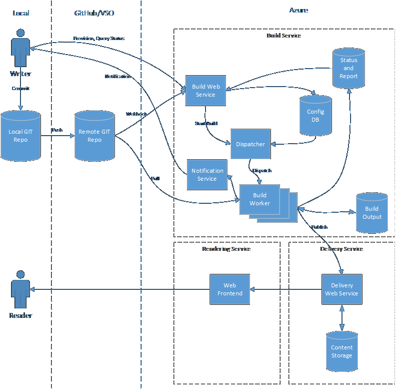

Open Publishing Build Design Memo
=================================

1. Scope
--------

A complete open publishing scenario consists of the following parts:

1. Writer creates a GIT repository and does necessary setup to make it an open publishing repo.
2. Writer authors a document (in markdown format) and adds it to his local GIT repo.
3. Writer pushes his local GIT repo to remote.
4. Open publishing picks up the GIT change and transforms the markdown file into output (in HTML format).
5. Open publishing delivers the output HTML file to the MSDN web site.
6. Open publishing sends notification to writer to let him know his document has been published.
7. Writer is able to view his document on MSDN web site.  

Open publishing build is mainly involved in #1 (**Provisioning**), #4 (**Build**), and #6 (**Notification**).

2. Architecture Design
----------------------

Here is a diagram of the overall architecture of build service.



There are three main services in open publishing:

1. Build, responsible for provisioning, transform user's content into output, push to delivery service and notify user.
2. Delivery, responsible for storage of content.
3. Rendering, responsible for render output into final HTML page.

And below is the flow for provisioning and publishing scenario:

Provisioning:

1. Writer create a GIT repo.
2. Writer calls build web service API to create an open publishing repository.
3. Build service writes repo information in configuration DB.
4. Build service calls delivery service to do necessary setup at delivery service side (like create delivery repo).
5. Build return success to user.

Publishing:

1. Writer commits a change to local GIT repo and push to remote.
2. GIT server send webhook to build web service.
3. Build web service calls dispatcher to dispatch build request.
4. Dispatcher reads configuration DB and dispatch build request to build worker.
5. Build worker pulls changes from GIT repo and read previous build output from storage to do an incremental build.
6. Build worker saves build output and build report to storage.
7. Build worker pushes build output to delivery service through delivery web service.
8. Build worker sends notification to writer about completion of publish.
9. (Alternative) Writer can also call build web service to query publish status.
10. Writer sees his content on MSDN web site (through rendering service).


3. Provisioning
---------------

The first step of open publishing is to create a GIT repository and connect it to open publishing so that any changes in this repo can be automatically published.

This step is called provisioning, which mainly contains two parts:

1. Git repository must be created following the schema defined by open publishing.
2. User must specify the GIT repository and necessary configuration through management portal or API.

> The design principle here is to make GIT repository self-contained, which means all information including content, metadata and configuration can be stored in a central place.
> So all publish operation can be done by manipulating GIT repo.
> But there will always be some configuration that is considered as "expensive" and cannot be done by manipulating GIT repo.
> These configuration need to be specified in #2.

### 3.1 GIT Repository Layout

Under a GIT repository, there will be multiple docsets. A docset is a group of documents that share the same configuration like template, base url, etc.
Each docset is a folder, under which there is a `docset.json` that defines the basic properties of a docset.

Under the root folder of a repository, there is a `siteCatalog.json` that defines all docsets in this repo.

> A docset must be added to `siteCatalog.json` to be detected by open publishing.

Here is a diagram that illustrates the structure of an open publishing GIT repo.

```
/
|- siteCatalog.json
|- docset1/
|  |- docset.json
|  |- a.md
|  \- b.md
\- docset2/
   |- docset.json
   |- c.md
   \- d.md
```

### 3.2 Connect GIT Repository with Open Publish

After a GIT repository is created, user must manually configure it to be monitored by open publishing.
This can be done through open publishing management portal or API.

Docset must be added to the monitor list manually, open publishing won't monitor docset creation/deletion and automatically provision them.
Docset creation is supposed to be a "heavy" operation so it need to be configured manually.

After this step, for all changes in a monitored docset, open publishing will automatically build it and publish the content to MSDN web site.

4. Build
--------

### 4.1 Docset Schema and File Format

A docset contains the following files:

1. `docset.json`, which defines the basic properties of a docset.
2. Document source files, currently we only support markdown file, but we're open to support more formats (e.g., HTML, ReST) in future.
3. `toc.md` that describes the TOC of the docset.
4. Support files, which are used by document source files, e.g., image, video, etc.

Here is a diagram that illustrates the structure of a docset:

```
/docset
|- docset.json
|- toc.md
|- docs/
|  |- get-started.md
|  \- overview.md
\- images/
   |- overview.png
   \- favicon.png
```

#### 4.1.1 Markdown File

Open publishing supports [Github Flavored Markdown](https://help.github.com/articles/github-flavored-markdown/), which is a superset of standard [Markdown](http://daringfireball.net/projects/markdown/).
Open publishing will also support additional extensions, like content include (more extensions to be added later).

Markdown file can also contain metadata. We employ [YAML frontmatter](http://jekyllrb.com/docs/frontmatter/) to store metadata.
This format is already widely used in github and will be rendered into a table in github markdown preview.

Here is one example:

```markdown
---
title: Get Started
toc_title: Get Started
---

body of the content...
```

#### 4.1.2 toc.md

`toc.md` is used to define the TOC (table of contents) structure of a docset.

We uses [headers](http://daringfireball.net/projects/markdown/syntax#header) to specify the level of toc. For example:

```markdown
# Tutorial
## Step 1
## Step 2
## Step 3
```

The above example illustrates a parent topic "Tutorial" with three children Step 1-3.

We use standard Markdown [link](http://daringfireball.net/projects/markdown/syntax#link) syntax to specify the target topic of the toc node. For example:

```markdown
# [Tutorial](tutorial.md)
## [Step 1](step-1.md)
## [Step 2](step-2.md)
## [Step 3](step-3.md)
```

If a toc node is not a link, it will become a container node (can contain children but cannot be clicked).
TOC node can also be an external link (for example, `www.bing.com`).

> Since markdown only support 6 levels of header, we'll only support 6 levels of TOC for now. This can be exteneded in future.

> `toc.md` cannot contain arbitrary markdown content. For example, you cannot have images in it. All content that are not headers will lead to build error.

### 4.2 Work with GIT Branch

In open publishing, we use GIT branches to maintain different copies of the same content.
Same topic in different branch will be published to different urls of rendering site.
This could be used in several scenarios:

1. Stage/promote. User can use one branch as staging branch and merge it to a live branch as a promote operation.
2. Private working branch. User can create his own branch to save files that is still under writing, and merge it to common branch when it's ready.
Files in private branch can still be validated/previewed by open publishing.

#### 4.2.1 Live Branch

Among all branches, there should be only one branch that is exposed to external users, as other staging/working branches are only used by writers for internal testing.
This branch is called "Live" branch. Live branch can be identified by a special branch name. Content in live branch will be published to the MSDN live site.
Content in other branches will still be published, but only in internal MSDN site.

Live branch can also be used to store branch related configuration. For example, if we want to have a configuration about which branches will be published (other branches will only be validated, as publish may be an "expensive" operation), this configuration can be stored in live branch.

#### 4.2.2 New Feature Dogfooding using Branches

It'll use a common case that user wants to try new features (like a new markdown extension) in his working branch while keep live branch using stable features.
We're going to support this by allow user to specify the build toolset they want to use (in GIT repo).
We'll release multiple versions of our build tool and let user to choose which one they want to use.
After they test the feature in working branch, they can merge the content to live branch then live branch will also upgrade to use the new build tool.

### 4.3 Monitor GIT Repository Changes

Open publishing will monitor changes in GIT repository and automatically build and publish changes. We'll leverage webhook provided by GIT server to get notified when there is an event happened on GIT repo.

> Our goal is to support any GIT repository, but GIT server implementation varies from one to another.
> Our principle to use standard GIT operation and minimize server-side GIT dependencies as much as possible, but there will always be specific GIT server implementation like webhook.
> Our first priority is to support [github](www.github.com) and [Visual Studio Online](www.visualstudio.com).

Both github and Visual Studio Online provides webhook ([github](https://developer.github.com/webhooks/), [VSO](https://www.visualstudio.com/get-started/integrate/service-hooks/webhooks-and-vso-vs)) to get notification on repo changes.

> In case webhook is not reliable (VSO webhook has known reliablity issue), polling is always an alternative solution.

For one repo, all changes will be built sequentially. There're two ways to build GIT changes:

1. For each changes in GIT repo, start a build.
2. Rolling build, aggregate all changes since last build and build them.

\#2 may be more efficient but #1 will be more accurate. For now we will use #1 to build changes.

### 4.4 Transform Markdown Files

We'll use open source markdown library ([marked.js](https://github.com/chjj/marked) is a good candidate) to transform markdown files to HTML files. There will be additional to develop transformation for markdown extensions.

Transform also includes other tasks, including:

1. Validation, validate source files and generate validation report
2. Generate TOC
3. Process metadata
4. Generate dependency information for incremental build

The output of transform will be in a folder structure. There're a few benefits for using files as output:

1. It can be run both locally or on build server, without taking additional dependencies like database.
2. Build result can be easily xcopied for troubleshoting.
3. It's easy to build version control on files for transaction control.

### 4.5 Template

*// Not clear for now*

### 4.6 Incremental Build

To increase publish system throughput and reduce publish response time, it's important to have an incremental build system.

There're several common scenarios that can benefit from incremental build:

1. User only modifies several files in a GIT repo, obviously there is no need to build the whole repo.
2. User merges from branch A to branch B, there is no need to build branch B as branch A should be already built, so it just need to copy the build output from branch A to B
3. User create a new branch B from branch A, similar to #2, only need to copy build result from branch A.

#### 4.6.1 Top-down Approach

Top-down approach is like traditional source code build, build scans all files in the repo to figure out which files needs rebuild.

For each file, build system will maintain a commit hash of the last build result, which can be used to determine whether a file is changed since last build.

For a source file, we'll check the following to determine whether the file needs rebuild:

1. The commit hash of the file itself.
2. If #1 differs, rebuild. Otherwise, a dependency information is maintained in last build output. Get the dependency information and check the commit hash for all dependencies.

> Build output can be organized in a folder structure so that we can quickly get the history build output by composing a path.
> For example:
>
> `//output/<commit_hash>/a.html`

#### 4.6.2 Bottom-up Approach

Bottom-up approach is to first detect which files are changed, then find out all files affected by changed files and rebuild them.
This will be more efficient for small changes in large repos as scaning a repo may still take a long time.

To achieve this, we first need to get the changed files since last build. This can be easily get by diff two commits in GIT repo.

Then we need to figure out the files affected by changed files. To get this information, a reverse dependency information is needed. We can store this information when build the source files.

The real implementation could be a combination of both approach, as bottom-up approach is more efficient but implementation may be error-prone. Top-down approach is less efficient but more accurate.

The following GIT operations should be interpreted correctly to have an efficient incremental build (if not, the build output is still correct but performance may be affected):

1. File rename
2. GIT new branch
3. GIT merge branch

> Since we don't another ID other than file path, we cannot get 100% accurate file rename information (GIT is not accurate on file rename).
> But as rename on live is a corner scenario, we'll just not support it. Rename will be simply a delete + add on delivery service (for build, detecting file rename will just have performance benifit).

#### 4.6.3 Diff TOC Change

*// Still pending on how TOC will be implemented at delivery service*

### 4.7 Integrate with Delivery Service

Delivery service will provide REST API to push build output. When talking with delivery service, we will use path to uniquely identifies a file.
As described in preview section, if path of a file changes, delivery service will treat it as a new file.

Delivery serivce has a concept of repository, which maps to docset at build side.

Delivery service also has the concept of branch for a repo, which maps to the GIT branch at build side.

As a result of incremental build, build will only push the changed documents to delivery service. If delivery service supports the following operation, build serivce can leverage them to improve publish performance.
If not, build will translate these operations to CRUD operations:

1. File rename
2. Branch merge

### 4.8 Scalability

*// To be written*

5. Notification
---------------

Publish is an asynchronized operation. It's triggered by GIT push, but it won't block push operation as publish may take a long time.
So there has to be a way to notify user when publish is completed (or failed).

The most basic notification functionality we will provide is publish status API.
User can use the last commit hash to call publish status API to get the pulbish status (succeeded, failed, processing) and publish report.

We can also consider to support query publish status using the following criteria:

1. Branch
2. Tag
3. GIT Revision range (01234567..89abcdef)
4. File path to query the status of a single file

The same query functionality will also be available on management portal.

Besides query API, we will also provide push functionality to let users be notified instead of polling:

1. Email
2. Webhook


6. API and Management Portal
----------------------------

As described in previous section, user will mainly interact with open publishing through GIT repo.
For example, to publish, user just need to do a GIT push. To configure a docset, user just update the configuration file in GIT repo.

But there're still some operations that need to be done outside GIT repo, like provision a repo, and as described in previous section, query a build.

All these operations can be done through open publishing API.

Open publishing API will be mainly supports the following operations:

1. Create a repo. Given a GIT repo url, creates a corresponding "repo" in open publishing.
2. Configure docset watchlist. Given an open publishing repo, add/remove docsets to be watched by open publishing.
3. Triggers a publish. Though a publish can be triggered by GIT push, there will be some cases that user wants to publish manually.
This API provides this functionality. The input parameters could be:
   - Branch
   - Tag
   - Commit hash
4. Query publish status and get publish report, already described in previous section.

Management portal is just a graphics interface that provides the same functionality as API.
