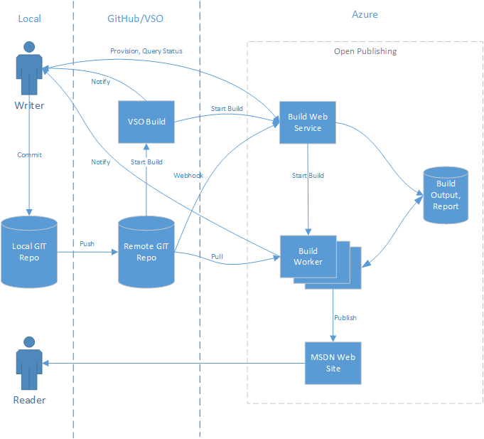

Open Publishing: User Experience and Design
===========================================

1. Scenarios
------------

### 1.1 Setup Repo

The first step of open publishing is to create a GIT repository and setup it as an open publishing repo.

For GIT repo, we currently plan to support both [GitHub](www.github.com) and [Visual Studio Online](www.visualstudio.com).
After GIT repo is created, user can go to the management portal of open publishing to setup the repo as open publishing repo.
During the setup process, user will be asked to authorize open publishing as an application to access GitHub/VSO resources, including pull code, create webhooks, etc.

> Management portal is a web site for user to interact with open publishing to perform operations including:
>
> 1. Setup repo
> 2. Manually trigger build
> 3. View build status/report

An open publishing repo consists of docsets.
A docset is a group of documents that share the same configuration like template, base url, etc. (similar to center in current OA).

### 1.2 Authoring

There're three parts that a user can author:

#### 1.2.1 Topic

We support authoring topics using [Markdown](http://daringfireball.net/projects/markdown/syntax) format. [GitHub Flavored Markdown](https://help.github.com/articles/github-flavored-markdown/) is by default supported.
We'll also support some extensions to enrich Markdown functionality:

1. File include
2. Code snippets
3. etc.

You can use any Markdown editor (like [MarkdownPad](http://markdownpad.com/), [Visual Studio Code](https://www.visualstudio.com/en-us/products/code-vs.aspx), [Markdown Mode](https://visualstudiogallery.msdn.microsoft.com/0855e23e-4c4c-4c82-8b39-24ab5c5a7f79)) you like to edit Markdown files.
Most of them provide live preview functionality so that you can get a simple preview when writing the topic.

#### 1.2.2 TOC

TOC is also described in Markdown format.

We use Markdown [header](http://daringfireball.net/projects/markdown/syntax#header) to specify the level of TOC and Markdown [link](http://daringfireball.net/projects/markdown/syntax#link) to specify the target topic of a toc node. For example:

```markdown
# [Tutorial](tutorial.md)
## [Step 1](step-1.md)
## [Step 2](step-2.md)
## [Step 3](step-3.md)
```

#### 1.2.3 Metadata

Metadata can be specified at two places:

In each topic, you can use [YAML frontmatter](http://jekyllrb.com/docs/frontmatter/) to store metadata in Markdown file.
This format is already widely used in github and will be rendered into a table in github markdown preview.
Here is one example:

```markdown
---
title: Get Started
toc_title: Get Started
---
```

You can also have a docset level metadata in the `docset.json`.

### 1.3 Validation and Preview

#### 1.3.1 Validate and Preview at Local

The open publishing build tool (which validates and transform Markdown to HTML) will be available in the form of nuget package.
User can easily restore the package to local and run the tool locally to get:

1. Build report that lists all errors in the content
2. If build succeeds, the output HTML files

The output HTML files may not contain header, footer or styles.
But user can still get a rough preview by applying simple styles.

#### 1.3.2 Preview on MSDN Site

For each push to GIT repo, open publishing will do a build to validate changes and publish them to MSDN.

We will support validation on any branch user created. Among all branches, only one of them will be treated at "live" branch that is mapped to MSDN Live site.
Preview on each branch will have the same functionality as it on live branch (header, footer, TOC, etc.).

For each GIT push, user will get email notification for whether the build has succeeded.
Also he is able to view build status and report on management portal.

### 1.4 Branch Integration

A common working model for GIT is user creates working branch for content that is not ready for publish and merges back the integration/live branch when he finishes authoring.

In his working branch, user can do authoring, validation, preview as described in 1.2 and 1.3. When he finishes authoring, he creates a pull request that merges from working branch to integration/live branch.

Using pull request mainly has two purposes:

1. Other users can review the changes and add comments.
2. Open publishing will build on pull request to ensure the changes merged to target branch don't have any problem.

For #2, GitHub and VSO's user experiences are bit different:

#### 1.4.1 GitHub

In GitHub, after a pull request is created, open publishing will start to build the changes and change the status of pull request to *pending*, meaning that PR should not be merged before build is completed.


There is also a "Details" link that will brings you the management portal which shows the progress of the build.

After build completes, if there is errors in the content, open publishing will mark the pull request as error, meaning that PR should not be merged:


A brief error message will be shown in the comment and "Details" link will brings you to the error report of the build.

After user made some fixes and update PR, open publishing will rebuild changes and mark PR as success if it passes build:


The "Merge" button now becomes green meaning it's now safe to merge the pull request. And "Details" will bring you to the preview page of the changes.

This user flow gives you a clear indication about whether a pull request can be merged when you're reviewing it.
But it **WILL NOT** block you from merging the pull request, as GitHub doesn't provide any infrastructure support for blocking a PR merge.

#### 1.4.2 Visual Studio Online

Similar to GitHub, when a pull request is created, an open publishing build will be kicked off.
On VSO, you will see a build is in progress. At this time, you cannot merge the pull request.


After build is completed, if there are errors, pull request cannot be merged.


If there is no error, pull request can be merged.


The difference between GitHub and VSO are:

1. VSO will block merge if build failed, meaning that you cannot click "Complete pull request" button, while GitHub will not.
2. GitHub will have a more descriptive message on the merge dialog and a "Details" link that brings you to the open publishing portal, where you can see a friendly report status and report.
While on VSO, there is no such message and "Details" link will brings you to the VSO build portal.


2. Design
---------

### 2.1 Overall Design

Here is an overall architecture diagram of open publishing system:



1. Writer commits a change to local GIT repo and push to remote.
2. GIT server calls build web service to start a build through web hook or VSO build.
3. Build web service dispatches the build request to build worker.
4. Build worker pulls changes from GIT repo and read previous build output from storage to do an incremental build.
5. Build worker saves build output and build report to storage.
6. Build worker publishes the content to MSDN web site.
7. Build worker sends notification to writer about completion of publish.
8. (Alternative) Writer can also call build web service to query publish status.
9. Writer sees his content on MSDN web site (through rendering service).

### 2.1 Authorization

We'll use OAuth to authorize open publishing as an application to access GIT resources.
OAuth is supported on both [GitHub](https://developer.github.com/v3/oauth/) and [VSO](https://www.visualstudio.com/en-us/integrate/get-started/auth/oauth).

User will be asked to grant open publishing permission when do the provisioning.

### 2.2 Integrate with GIT Events (Push, Branch, Pull Request)

For general events like push and branch, we will use webhook ([github](https://developer.github.com/webhooks/), [VSO](https://www.visualstudio.com/get-started/integrate/service-hooks/webhooks-and-vso-vs)) to get notification on repo changes.

### 2.2.1 Visual Studio Online

For VSO, we will integrate with VSO build. VSO build provides the following functionalities:

1. Triggers build when code is pushed to GIT repo
2. Triggers build when a PR is created and block PR merge if build failed (through [branch policy](https://msdn.microsoft.com/Library/vs/alm/Code/git/branch-policies)).

So the integration model between VSO and open publishing will be:

1. Open publishing provides APIs to trigger a build and query the status of a build.
2. For a GIT repo, a VSO build definition is setup outside open publishing, to monitor events on GIT repo and call open publishing to start build.
3. The VSO build definition will do the following:
   * Call open publishing API to start a build.
   * Wait until build is finished.
   * Call status API to get the build status.
   * Decide whether to block PR merge based on the build status.

### 2.2.1 GitHub

For GitHub, VSO doesn't provide enough support especially on pull request. So open publishing will integrate with GitHub through webhook.

The integration flow will be:

1. Open publishing subscribes GIT event through webhook.
2. GitHub calls open publishing API when there is push or pull request.
3. Open publishing starts build to validate and publish content.
4. Open publishing sends notification about build status to user (e.g. through email).
5. For pull request, use [status API](https://developer.github.com/v3/repos/statuses/) to provide UI indication about whether the PR can be merged.
